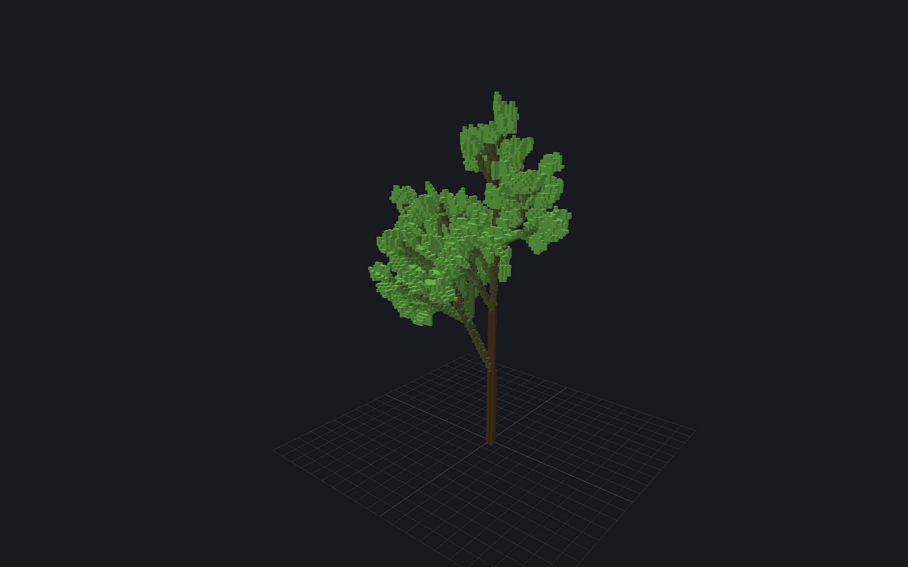

# plant-lsystems

[](https://github.com/VinzentOrtmann/plant-lsystems/actions/workflows/ci.yml)

A procedural plant generator in C++20. It grows a plant from a parametric,
stochastic L-system, walks the resulting string with a 3D turtle to build a
branch skeleton, rasterizes that skeleton into a sparse voxel grid via tapered
cylinder sweeps, and exports the result as a MagicaVoxel `.vox` file. A live
OpenGL viewer lets you drive the grammar parameters and watch the plant
regenerate.

```
grammar + params -> L-system string -> turtle -> branch skeleton -> voxel grid -> .vox
```



*`plant-gen leafy 10 3` — 6,645 modules rewritten into 511 branch segments and
511 leaf polygons, voxelized to 15,906 voxels. Captured with the viewer's own
screenshot button.*

## Status

Built in milestones; this is where things stand.

| # | Milestone | State |
|---|-----------|-------|
| 1 | CMake + FetchContent build, GLFW window, OpenGL 3.3 core, Dear ImGui | **done** |
| 2 | L-system core: parametric + stochastic rewriting, fern/tree presets | **done** |
| 3 | Turtle interpreter -> branch skeleton, debug line rendering | **done** |
| 4 | Voxelizer: tapered-cylinder sweep into a sparse grid | **done** |
| 5 | MagicaVoxel `.vox` writer | **done** |
| 6 | Live viewer: voxel rendering + ImGui parameter sliders | **done** |
| 7 | Catch2 coverage for expansion and voxelization | ongoing (155 tests) |

Since the milestones, following *The Algorithmic Beauty of Plants*: tropism
(ch. 2), `random()` in expressions (ch. 7), context-sensitive productions with
tree-aware matching (ch. 1, applied in ch. 3), and polygon surfaces for leaves
(ch. 5) and box-counting dimension (ch. 8). Plus animated growth off a
generation cache, JSON grammars with live reload, and seed sheets.

`plant-gen` runs the whole pipeline and drops you in a viewer with sliders for
every parameter. Drag one and the plant regenerates; press **Write .vox** to
export what you are looking at.

```bash
plant-gen [preset] [iterations] [seed] [resolution] [-o out.vox] [--sheet N]
          [--presets DIR] [--load record.vox.json] [--capture DIR [--capture-frames N]]
```

The arguments only set the starting state, which the sliders take over from
there; `plant-gen --help` lists the presets. Left drag orbits, right drag pans,
the wheel zooms.

## The grammar

Grammars are parametric and stochastic. A module is a symbol plus numeric
parameters; a production rewrites one module into a sequence of modules,
computing the new parameters with arithmetic over the matched ones:

```
A(l,w) : l > 0.12 -> F(l,w) [ +(32) A(l*0.72, w*0.7) ] /(137.5) [ -(32) A(l*0.72, w*0.7) ]
\_____/  \_______/    \_____________________________________________________________________/
predecessor condition                              successor
```

Rewriting is parallel: every module is replaced simultaneously, which is what
makes an L-system model growth rather than sequential execution. Several
productions may share a predecessor, in which case one is drawn at random,
weighted by an optional trailing probability:

```
A(l) -> F(l) [ +(25) A(l*0.8) ] : 3
A(l) -> F(l) A(l*0.9)           : 1
```

Expressions support `+ - * /`, comparisons, short-circuiting `&& || !`, and
`sin cos tan sqrt abs floor ceil min max pow clamp random` — trigonometry in
degrees, matching the angle symbols. Identifiers resolve to a formal parameter
or a named constant at compile time, so a typo is a `ParseError` naming the rule
rather than a plant that grows wrong.

`random(lo, hi)` draws from the *same* generator the production weights use, so
a seed still reproduces exactly one plant. The two kinds of variation do
different jobs: weighted productions vary the **structure**, `random()` varies
the **numbers** within whichever rule fired. Structure alone leaves every branch
at a given depth geometrically identical, which reads as artificial however good
the branching is.

It is rejected in the axiom, with a `ParseError`. The axiom is evaluated once at
compile time, before a seed exists, so a draw there would be silently frozen
across every seed.

### Context

A production may require context, written `left < strict > right`:

```
A(x) < F(l) > B -> F(l*x)
```

Either side may span several modules, and all three parts bind formals into one
flat parameter vector — left context, then predecessor, then right context — so
a successor can read a neighbour's parameters as easily as its own.

The important part is that **context is matched in the tree the brackets
describe, not in the flat string.** Left context is the chain of *ancestors*, so
walking backwards hops over each sibling subtree in one step (via a precomputed
bracket table) and steps past a `[` to ascend. Right context is any path of
*descendants*, so it tries each bracketed branch in turn and backtracks,
unwinding its bindings, before falling through to the module continuing the
axis.

That distinction is the whole point. In `A[X]B` the bracketed `X` is a *sibling*
of `B`, so `A < B` matches and `X < B` does not. In `A[P]C[P Q]` the second
branch hangs off `C`, not `A`, so `A > P Q` does not match even though "P Q"
sits to A's right in the string. Both are tests.

Context is read from the word as it stood at the *start* of the step, never
from the output being built — rewriting stays parallel. Grammars with no
context-sensitive productions skip the machinery entirely and pay nothing.

Arity is part of the match: a production for `A(l,w)` never fires on a bare `A`,
and a module with no matching production passes through untouched — which is how
the turtle symbols (`F + - & ^ \ / [ ]`) survive every iteration.

Given a grammar, `expand(iterations, seed)` is fully deterministic; the RNG is
only consulted where a module genuinely has competing productions, so
`simple-tree` and `fern` ignore the seed entirely while `bush` responds to it.
The weighted draw is hand-rolled rather than `std::uniform_real_distribution`,
whose output is not specified across standard library implementations — a seed
has to reproduce the same plant everywhere.

Grammars are loaded from [assets/presets/](assets/presets) as JSON and
**reloaded whenever a file changes** — edit a rule in your editor and the plant
regrows without leaving the viewer. The same set is compiled into
[src/lsystem/Presets.h](src/lsystem/Presets.h) as a fallback when no directory
is found, and `--dump-presets DIR` regenerates the files from it.

A runaway grammar hits a module budget and throws instead of exhausting memory.

| Preset | Shape | Settles at |
|--------|-------|-----------|
| `simple-tree` | Monopodial tree, central leader, golden-angle laterals | 32 iterations, 24.6k segments |
| `fern` | Frond with paired pinnae, self-similar two levels deep | 26 iterations, 4.7k segments |
| `bush` | Stochastic shrub, three competing habits plus jittered geometry | 12 iterations, ~640 segments |
| `signal` | Context-sensitive: a signal climbs the stem dropping laterals | 40 iterations, 1.6k segments |
| `leafy` | Branching shoot whose twigs end in filled polygon leaves | 10 iterations, 511 segments + 6.6k leaf voxels |

## The turtle

[src/turtle/Turtle.h](src/turtle/Turtle.h) walks an expanded word and emits a
branch skeleton: a flat list of tapered-cylinder segments, each carrying its
endpoints, start and end radius, parent index and branch depth. Segments appear
in drawing order, so a parent always precedes its children — the taper pass and
the voxelizer both rely on that.

The turtle carries a position and an orthonormal frame (heading H, left L, up U,
with H × L = U) stored as a quaternion. Identity points it along +Y with
L = −X and U = +Z.

| Symbol | Effect |
|--------|--------|
| `F(len,width)` | draw a segment and move to its end |
| `f(len)` | move without drawing |
| `+(a)` `-(a)` | yaw left/right — rotate about U |
| `&(a)` `^(a)` | pitch down/up — rotate about L |
| `\(a)` `/(a)` | roll left/right — rotate about H |
| `$` | roll upright: spin about H until U points as close to world up as it can |
| `!(width)` | set the current width |
| `[` `]` | push/pop the whole turtle state |
| `{` `}` | begin/end a filled polygon |
| `.` | record the current position as a polygon vertex |

Parameters are optional everywhere; a bare `+` falls back to
`TurtleConfig::defaultAngle`. Symbols with no meaning are skipped, which is what
lets non-drawing buds survive in a word that was not expanded to completion.

Two details that are easy to get wrong:

- **Roll is not decorative.** Yaw turns about U, so a plant built from `+` and
  `-` alone stays perfectly flat forever — and so does one rolled by 180°, which
  merely swaps a symmetric pair for itself. The first version of the fern preset
  did exactly that and came out planar.
- **A segment's end radius comes from its thickest child**, not from its own
  parameter, so a trunk narrows smoothly into its branches instead of stepping
  down. Childless segments taper to a tip, and a segment never widens towards
  its tip even if a child asks for more width.

`TurtleConfig::angleScale` and `radiusScale` multiply every rotation and radius,
so the viewer can sweep branch angle and thickness without recompiling the
grammar — values baked into constants are otherwise fixed at compile time.

### Tropism

After each drawn segment the turtle is rotated by `strength · |H × T|` radians
about `H × T`, bending the heading towards the tropism vector `T` — the model
from *The Algorithmic Beauty of Plants*, chapter 2. Default `T` is straight
down, so positive strength droops under gravity and negative reaches for the
light out of the same knob.

The `|H × T|` factor is the whole trick, and it does two things at once. It is
the sine of the angle still to close, so bending is strongest across the
tropism and vanishes along it: a vertical leader stays dead straight while a
horizontal limb sags hard. And because it decays as the heading swings around,
a branch **asymptotes** onto the tropism rather than spinning past it. A chain
under strength 0.4 settles pointing straight down and stays there; two tests
pin that, one on the decay (`0.1 + 0.1·cos(0.1) < 0.2`) and one on
monotonicity over 200 segments.

The rotation axis is in world space, so it pre-multiplies the orientation
quaternion — unlike the rotation symbols, which compose into the turtle's local
frame.

### Polygons

`{` opens an outline, `.` pins a corner wherever the turtle currently stands,
`}` closes it. A leaf is just the turtle walking its own perimeter:

```
L(s) -> { . +(45) f(s) . -(90) f(s) . -(90) f(s) . }
```

which traces base → left corner → tip → right corner. Nothing special makes a
leaf face the right way: it is the *same* turtle, so it starts in whatever frame
the branch left behind and inherits the twig's orientation for free.

The polygon stack is deliberately independent of the `[ ]` state stack, because
an outline is normally traced across branches. Outlines enclosing no area (fewer
than three corners) are dropped, and a `.` outside any polygon is discarded.

## The voxelizer

Each segment is swept as a sphere whose radius interpolates from the segment's
start radius to its end radius — a *round cone*. Voxels whose centre falls
inside that solid are filled. Consecutive segments share an endpoint *and* a
radius there, so their swept spheres coincide and joints close without any
special handling; a test flood-fills each preset and asserts the result is a
single 26-connected component.

The membership test is worth spelling out, because the obvious version is wrong.
Projecting the point onto the axis and comparing against the interpolated radius
*under-fills* a tapered segment — the nearest point on the axis is not the sphere
that reaches furthest. Testing the true union of spheres instead means asking
whether any `t ∈ [0,1]` satisfies `|p − c(t)|² ≤ r(t)²`, which expands to a
quadratic in `t`:

```
f(t) = A·t² − 2B·t + C     A = |d|² − Δr²
                           B = (p−a)·d + r₀·Δr
                           C = |p−a|² − r₀²
```

so the test collapses to minimising a parabola over `[0,1]`. When `A ≤ 0` one end
sphere swallows the other and the union is just the bigger one.

Two details that matter:

- **`minRadiusVoxels` defaults to √3/2 ≈ 0.87**, half a voxel diagonal. That is
  the smallest radius guaranteeing every point of a segment's axis has a voxel
  centre within reach, which is what stops the thinnest twigs from rasterizing to
  a dotted line.
- **The grid is sized from the radii actually rasterized**, not from
  `Skeleton::bounds`. The minimum-radius floor inflates twigs thinner than a
  voxel, and a grid built from the skeleton's own bounds clips that growth
  against its walls — which is exactly what the first version did.

Polygons take a second path: fanned into triangles from their first vertex —
exact for the convex outlines grammars trace — then filled as a slab of even
thickness. Evenness needs the *closest point on the triangle*, by Voronoi
region: face, three edges, three vertices. Testing against the plane alone
would let the slab run past the edges; testing distance to the triangle's
interior only would taper it. Foliage gets its own palette slot off the branch
ramp, so leaves read as leaves rather than as more twig tips.

[VoxelGrid](src/voxelize/VoxelGrid.h) is a hash map keyed by linear index: the
bounding box of a tree is mostly air, and a dense 256³ array would be 16 MB of
which a fraction of a percent is occupied. `toVector()` returns voxels ordered by
z, then y, then x, since the hash map's own order is unspecified and the exporter
needs a stable one.

Measured on `simple-tree`, RelWithDebInfo:

| Plant | Segments | Grid | Voxels | Time |
|-------|---------|------|--------|------|
| 14 iterations, resolution 128 | 6,623 | 72×131×85 | 12,736 | 14.9 ms |
| 20 iterations, resolution 256 | 20,671 | 149×259×171 | 57,808 | 53.4 ms |

Note the 259 on that second row: `RasterizerConfig::maxDimension` defaults to 512
so you can preview at higher resolution than you export, but MagicaVoxel's own
limit is 256 per axis, and the exporter rejects anything past it.

## The .vox exporter

[src/export/VoxWriter.h](src/export/VoxWriter.h). The format is a header
followed by a tree of RIFF-style chunks, each
`id[4] | int32 contentBytes | int32 childBytes | content | children`. A
single-model file needs three chunks under MAIN: SIZE, XYZI and RGBA.

Encoding is separated from the file write, so the format is tested without
touching the filesystem — and the tests parse the bytes back with their own
minimal reader, checking the writer against the *format* rather than against
itself.

Three things the format will quietly punish you for:

- **The palette is shifted by one.** The spec's own reader does
  `for (i = 0; i <= 254; i++) palette[i + 1] = ReadRGBA();`, so colour index 1
  must be the *first* entry on disk and the 256th entry is never read. Writing
  it unshifted tints the whole model by one slot.
- **MagicaVoxel is Z-up; this project is Y-up.** The mapping
  `(x, y, z) → (x, depth−1−z, y)` moves the up axis and flips the remaining one,
  which keeps the determinant at +1. Simply swapping Y and Z would mirror the
  model and turn every left-handed branch spiral into a right-handed one — a
  test computes that determinant explicitly.
- **Coordinates are single bytes**, so no axis may exceed 256. `encodeVox`
  throws `VoxWriteError` rather than truncating.

Verified end to end: `simple-tree` at 14 iterations, resolution 128 exports a
52,040-byte file — exactly `8 + 12 + 24 + (12 + 4 + 12736×4) + (12 + 1024)` —
which an independent parser reads back as `SIZE = (72, 85, 131)`, 12,736 voxels
all inside the padding, no index 0, and the ramp landing on palette indices 1–7.

## The viewer

Voxels are drawn as **instanced unit cubes**: one 24-vertex cube in a static
buffer, one `(centre, colour)` pair per voxel with an attribute divisor of 1.
Meshing the surface would emit far fewer triangles, but at these counts the GPU
does not care, and regeneration only has to re-upload a flat array. Colours come
from the same palette the exporter writes, so the preview matches what
MagicaVoxel will show.

The sliders drive a **staged** pipeline. Each parameter invalidates only the
work downstream of it, so dragging the resolution slider does not re-expand a
70,000 module word:

| Slider | Reruns from |
|--------|-------------|
| preset, iterations, seed | rewriting |
| angle, thickness, tropism | the turtle |
| resolution | voxelization |

Angle and thickness are `TurtleConfig::angleScale` / `radiusScale` rather than
grammar constants, which is what lets them skip the rewriting stage entirely.
The trade-off: they cannot influence conditions, so an angle that feeds a
`: l > minLength` guard would need a recompile instead. Tropism is purely
geometric and never touches the grammar at all.

The UI never learns about any of this — `main` just compares the previous and
current `PlantParams` and picks the earliest stage that changed. A regeneration
that throws (`VoxelizeError`, a module budget overrun) leaves the last good
plant on screen and shows the message under the export button.

### Live grammar editing

A grammar file mirrors `GrammarSource` one field at a time:

```json
{
  "name": "leafy",
  "description": "Branching shoot whose twigs end in filled polygon leaves.",
  "axiom": "A(1, 0.05)",
  "constants": { "branchAngle": 32.0, "divergence": 137.5, "leafSize": 0.16 },
  "rules": [ "A(l,w) : l <= minLength -> F(l,w) [ L(leafSize) ]" ]
}
```

The directory is polled twice a second — a handful of `stat` calls — and a
revision built from filenames and write times decides whether anything actually
changed, so an untouched folder never triggers a rebuild.

Three things matter for this to be usable while typing:

- **A broken file must not empty the library.** Mid-edit, JSON is routinely
  invalid; only that file is dropped, and its error is reported with its name.
- **A grammar that parses but does not compile keeps the last good plant on
  screen**, with the reason shown under the export button — the parser already
  quotes the offending rule, so the message is *"unknown identifier
  'nosuchconstant' … in rule: A(l,w) : l <= minLength -> F(l,w) [ L(nosuchconstant) ]"*.
- **The selection follows the grammar by name**, not by index, since a reload
  can reorder the directory underneath it.

Reading and writing JSON lives in its own library,
[GrammarIO](src/lsystem/GrammarIO.h), deliberately *not* in `plant_lsystem`:
rewriting has no dependencies at all and that is worth keeping, so the core and
its tests build without nlohmann/json.

Constants are written as the shortest decimal that reads back as exactly the
same float. Stored straight, a float widens to double and `0.16f` dumps as
`0.1599999964237213` — correct, and unreadable in a file meant to be edited by
hand.

### Provenance

Every `.vox` export writes a `.vox.json` beside it recording the parameters that
produced it — and the **grammar itself**, embedded rather than referenced by
name, because a preset file can be edited afterwards and a record pointing at
"leafy" would then describe a plant that no longer exists.

```bash
plant-gen bush 11 42 96 -o prov.vox      # writes prov.vox and prov.vox.json
plant-gen --load prov.vox.json -o again.vox
```

Those two `.vox` files are byte-identical, SHA-256 verified. A specimen in your
output folder is a specimen you can get back.

The record is deliberately its own schema rather than a mirror of the viewer's
parameter struct — the file should outlive a UI refactor — and every field in
`parameters` is optional on read, so a hand-trimmed or older file degrades to
defaults instead of failing.

### Capture

**Screenshot** renders the scene into an offscreen buffer at 1–4× the window
size and writes a PNG; **Turntable** sweeps a full orbit over N frames, with an
option to advance growth from bare to full across the sweep — which is a trailer,
minus the editing.

Captures use the *same* draw calls as the window, into a framebuffer object, so
a capture is by construction the same image only larger — and it excludes the
ImGui panels, because those are drawn afterwards. Frames are rendered one per
application frame rather than in a blocking loop, so the window keeps responding
and the progress line actually updates. 24 frames at 2560×1600 with a growth
sweep takes about 5 seconds and 3.5 MB.

Both are also available headlessly, which is how the feature is testable at all:

```bash
plant-gen leafy 10 3 --capture shots --capture-frames 120
```

PNG encoding is stb_image_write. stb publishes no tags whatsoever, only a moving
master, so it is pinned to a commit — less readable than a version, and the only
reproducible option available.

### Measuring a plant

The statistics panel reports a **box-counting dimension** — chapter 8 of *The
Algorithmic Beauty of Plants*. Cover the model in boxes of edge 1, 2, 4, 8 …
voxels, count how many are occupied at each size, and take the slope of
`log(boxes)` against `log(1/size)`. A filled solid measures 3, a flat sheet 2,
a straight line 1; a plant lands in between, and where it lands is a compact
description of how densely it fills the space it occupies.

| Model | Dimension |
|-------|-----------|
| `leafy` at 10 iterations | 1.996 |
| `simple-tree` at 10 iterations | 1.624 |

Those two branch similarly, but one ends every twig in a filled surface — and a
plant made of surfaces approaches 2 while a bare branching curve sits well below
it. That is one number you can sweep a parameter against, which is the whole
reason to have it.

Two implementation details decide whether the number means anything:

- **Boxes are anchored to the model's own corner, not the grid's.** Otherwise
  the same shape measures differently depending on where padding left it,
  because at coarse sizes it straddles a different number of cell boundaries.
  A test shifts a sheet by (7, 5, 3) and requires a bit-identical result.
- **The fit excludes box sizes where the count has collapsed towards one.**
  `log(1)` is zero however fractal the model is, and including those points
  drags the slope down.

Calibration tests measure a solid cube, a sheet and a line to within 0.02 of 3,
2 and 1, and a four-level Menger-like sponge to confirm the fit produces genuine
non-integer values rather than rounding to the nearest whole number.

### Seed sheets

`--sheet 3`, or the slider, lays out nine plants from nine consecutive seeds —
the whole point of a stochastic grammar is the spread of what it produces, and
one specimen at a time never shows that.

Specimens are spaced by the widest footprint among them, so neighbours never
overlap however differently they grew, and the layout is centred on the origin
so the camera behaves the same in both modes.

The merge is the part with a constraint. Every specimen is voxelized at **one
shared voxel size** and then blitted into a single volume, because a merged grid
has one origin and one scale — voxelizing each plant to its own bounds would
give each a different size and make the merge meaningless. `resolution` therefore
counts voxels across the longest axis of *everything on screen*, which is also
what keeps a 3×3 export inside MagicaVoxel's 256 limit rather than blowing
straight past it.

One deliberate asymmetry: a single plant comes from the generation cache so
scrubbing stays free, while a sheet expands each seed directly. Caching every
generation of nine plants would cost far more memory than it saves.

Because the sheet is one merged grid, export, statistics and rendering all work
on it unchanged — a 3×3 `.vox` is a contact sheet you can open in MagicaVoxel.

### Animated growth

**Play** scrubs forward through generations on a timer; the iteration slider is
the scrub bar, and pressing play resumes from wherever it was left. The phase is
kept as a double so speed is independent of frame rate — the integer iteration
count is only sampled from it.

What makes this cheap is that `expand(n)` is just `step()` applied *n* times off
one generator, so generations are **cached** rather than recomputed: extending
by one generation costs one `step()`, and every position already visited costs a
vector lookup. Scrubbing `simple-tree` from generation 20 back to 0:

| | Time |
|---|------|
| Re-expanding each position from the axiom | 69.7 ms |
| Building the cache once, forward | 11.6 ms |
| The same scrub, served from cache | 0.0002 ms |

The cost is memory: 20 generations of `simple-tree` is 401,631 modules held at
once, roughly 30 MB. Resetting on a preset or seed change is what keeps it
bounded.

The correctness this rests on is that stepping incrementally gives exactly what
a fresh `expand(n, seed)` would — one extra draw from the generator, or a
different order, and playback would silently diverge from the seed it claims to
show. That is a library-level invariant, so it has a library-level test.

### Cost

Regeneration cost for `simple-tree` at 14 iterations, resolution 128:

| Stage | RelWithDebInfo | Debug |
|-------|----------------|-------|
| rewriting | 3.9 ms | 59.8 ms |
| turtle | 0.5 ms | 8.3 ms |
| voxelization | 8.0 ms | 184.2 ms |

Comfortably interactive in release; noticeably laggy in Debug, which is the
reason for the note above.

## Building

Requires CMake ≥ 3.25, a C++20 compiler, Git, and Python 3 (glad generates its
OpenGL loader from the Khronos registry at configure time — see
[cmake/Glad.cmake](cmake/Glad.cmake); if Jinja2 is missing, the build
provisions a throwaway venv for it inside the build tree). Everything else is
fetched by CMake.

```bash
cmake --preset msvc && cmake --build --preset msvc && ctest --preset msvc
```

The first configure clones six dependencies and takes a few minutes. Swap
`msvc` for `msvc-release` throughout to build RelWithDebInfo — worth it, since
Debug regenerates about ten times slower and the sliders feel it.

Presets live in [CMakePresets.json](CMakePresets.json):

- `msvc` — Visual Studio 2022 generator, x64. Works from an ordinary shell.
- `ninja` — single-config Ninja. On Windows, run it from a Developer Command
  Prompt so `cl.exe` is on `PATH`.
- `ci` — pins no generator at all, so it builds against whatever toolchain is
  installed. Use this if `msvc` cannot find your Visual Studio; pinning a
  version is convenient right up until the machine has a different one.

On Linux, GLFW needs development headers for both display stacks to configure —
since 3.4 it builds Wayland support by default, and a missing `wayland-scanner`
fails the configure outright:

```bash
sudo apt-get install -y ninja-build libgl1-mesa-dev \
  libx11-dev libxrandr-dev libxinerama-dev libxcursor-dev libxi-dev \
  libwayland-dev libwayland-bin wayland-protocols libxkbcommon-dev
```

To produce something you can hand to someone else:

```bash
cmake --install build/msvc --config RelWithDebInfo --prefix dist
cpack --config build/msvc/CPackConfig.cmake -C RelWithDebInfo
```

That gives a `dist/` folder — executable, README and `assets/presets` — and a
zip of it. The grammars ship *alongside* the executable rather than baked in, so
an installed copy is still editable and still hot-reloads.

CI builds and tests on Windows/MSVC and Linux/GCC. The Linux job is the only
thing that actually verifies the portability this project otherwise just claims;
it runs the whole suite headless, because the test binary links only the
computational stages and never the viewer.

That includes the golden hashes, which was not a given — they pin *float-derived*
voxel indices and were generated under MSVC. GCC produces the same values, so
the lock turns out to be a cross-toolchain guarantee rather than a Windows-only
one. Two genuine portability facts came out of setting this up: GLFW's Wayland
requirement above, and this.

The Visual Studio generator is multi-config, so binaries land in
`build/msvc/bin/Debug/` and `build/msvc/bin/RelWithDebInfo/`. Those directories
are deliberately *not* flattened into one: the two configurations would
overwrite each other, and `ctest -C Debug` would then happily run whichever
build landed there last.

## Dependencies

All fetched with `FetchContent` as release archives pinned by SHA-256; nothing
is vendored in-tree. Archives rather than clones deliberately: a hash pins a
source tree at least as firmly as a tag, the download is a fraction of the size,
and it sidesteps a failure that repeatedly wedged the build on Windows —
FetchContent decides to re-populate a dependency, something still holds the git
working tree, and the removal fails until you delete the directory by hand. An
extracted archive has no working tree to hold.

| Library | Version | Used for |
|---------|---------|----------|
| [GLM](https://github.com/g-truc/glm) | 1.0.3 | vectors, quaternions, the turtle's transform stack |
| [GLFW](https://github.com/glfw/glfw) | 3.4 | window and OpenGL context |
| [glad](https://github.com/Dav1dde/glad) | 2.0.8 | OpenGL 3.3 core function loader (generated) |
| [Dear ImGui](https://github.com/ocornut/imgui) | 1.92.9 | parameter UI |
| [nlohmann/json](https://github.com/nlohmann/json) | 3.12.0 | loading preset rule files |
| [Catch2](https://github.com/catchorg/Catch2) | 3.9.1 | unit tests |
| [stb_image_write](https://github.com/nothings/stb) | pinned commit | screenshot and turntable PNGs |

ImGui ships no build system, so `cmake/Dependencies.cmake` compiles the core
plus the GLFW/OpenGL3 backends into a static `imgui` target.

## Layout

```
CMakeLists.txt          top-level build, shared compile options
CMakePresets.json       msvc / ninja presets
cmake/
  Dependencies.cmake    every FetchContent declaration, pinned by tag
  Glad.cmake            glad fetch + loader codegen (incl. Python bootstrap)
src/
  lsystem/              grammar parsing, parametric + stochastic rewriting
  turtle/               L-system string -> 3D branch skeleton
  voxelize/             skeleton -> sparse voxel grid
  export/               MagicaVoxel .vox writer
  viewer/               GLFW/GL renderer and ImGui panels
  main.cpp
assets/presets/         rule sets as JSON data, watched for live reload
tests/                  Catch2 suite, registered with CTest
```

Each pipeline stage is a separate CMake library so the tests can link the pure
computational stages without needing a window or a GL context: `plant_lsystem`
has no dependencies at all, `plant_turtle` adds only GLM, and nothing below the
viewer touches OpenGL. The `export` namespace is spelled `plant::vox`, since
`export` is a reserved word in C++20.

## Tests

Two kinds, doing different jobs.

Most of the 138 assert a **property** — that brackets balance, that a signal
climbs one internode per step, that a polygon slab has even thickness, that
9:1 weights actually bias the draw. They say what the code is *for*.

None of them would notice the pipeline quietly producing a slightly different
plant, so [tests/test_golden.cpp](tests/test_golden.cpp) pins the bytes: for
each preset at fixed parameters, the segment count, the voxel count, an FNV-1a
hash of the voxel grid, and a hash of the encoded `.vox` file. Nudging one
grammar constant by 0.05° trips it. The hash is hand-rolled because
`std::hash` is implementation-defined and these values are checked in, and it
covers voxel *indices* rather than float positions — which voxels are filled is
the observable output, and hashing floats would break on any harmless change of
rounding.

The values are identical between Debug and RelWithDebInfo, and — verified in CI —
between MSVC and GCC, which is what makes the lock usable rather than flaky.
When one legitimately changes, the failure message carries its own replacement
line to paste in.
